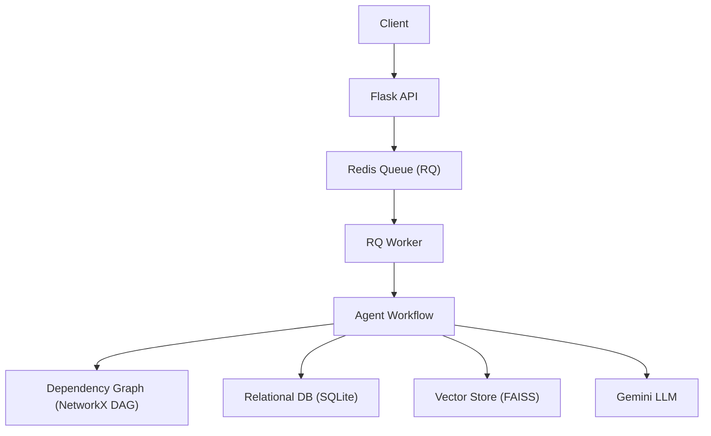
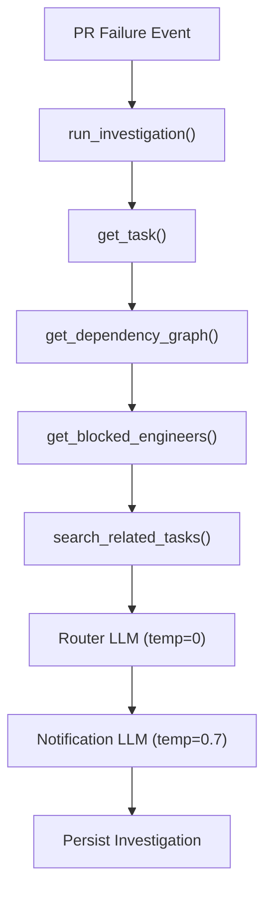

# Architecture Overview

## High-Level System Diagram

---
## Agent Flow

----

## Data Layer

### Relational DB

SQLite tables:

-   Engineer
-   Task
-   Dependency
-   PREvent
-   ActivityLog
-   Investigation

---

### Dependency Graph

-   Built from Dependency table
-   Directed Acyclic Graph (DAG)
-   Supports:
    -   upstream blockers
    -   downstream impact
    -   N-hop search
  
----

### Vector Store

-   SentenceTransformers embeddings
-   FAISS IndexFlatIP
-   Cosine similarity
-   Metadata filtering

---
## Why Redis Queue?

LLM calls are slow.

Async design:

-   API responds instantly
-   Worker handles AI processing
-   Improves scalability
-   Prevents request timeouts

---

## Observability

Each agent step logs:

-   tool name
-   duration
-   timestamp

Stored in tool_trace for inspection.

---

## Design Tradeoffs

### SQLite vs PostgreSQL

SQLite used for simplicity.

Production would require PostgreSQL for concurrency safety.

----------

### FAISS vs pgvector

FAISS chosen for lightweight local vector storage.

Production would use pgvector or managed vector DB.

----------

### Deterministic Router

Structural reasoning (graph) is deterministic.

LLM used only for classification & communication.

----------

## Scalability Path

To scale:

-   Add multiple RQ workers
-   Replace SQLite with Postgres
-   Persist FAISS index to disk
-   Add monitoring stack

----------